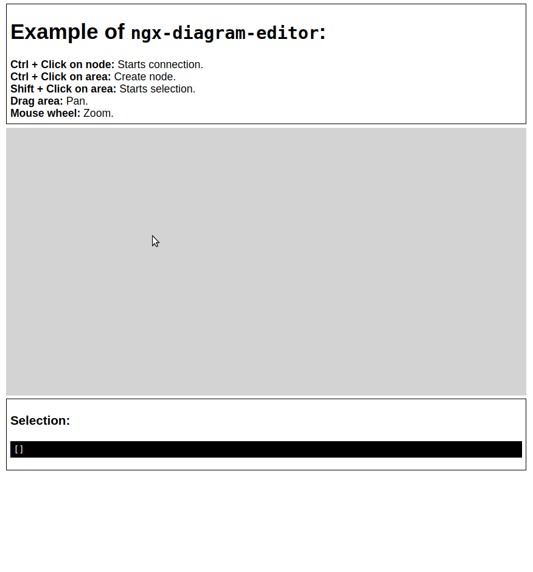

# ngx-diagram
Angular 6 HTML+SVG based diagram editor component

### Looks like this (with elkjs)



### Usage

Place your div node into a template as:
```
<ngx-diagram #diagram (connected)="connected($event)" (clicked)="created($event)" (selected)="selected($event)">
    <ng-template let-node="node">
    
    <div>{{node|json}} <!-- This is your div box as a node -->
    </div>
    
    </ng-template>
</ngx-diagram>
 ```
 
The example component is then:
```

export class AppComponent {

    @ViewChild('diagram') diagram: NgxDiagramComponent;
    selection = [];

    nodes = [];
    links = [];

    ngOnInit() {

        this.nodes = [{id: id()}];
        for (let i = 0; i < 10; i++) {
            const idl = id();
            this.nodes.push({id: idl});
        }

        this.nodes.forEach(source => {
            for (let i = 0; i < 1; i++) {
                const target = this.nodes[Math.floor(Math.random() * this.nodes.length)];
                if (source.id !== target.id) {
                    this.links.push({source: source.id, target: target.id});
                }
            }
        });

        this.diagram.updateNodes(this.nodes); // First the nodes then the links
        this.diagram.updateLinks(this.links);
        this.diagram.redraw();


    }

    connected(connection) {

        if (connection.source.id !== connection.target.id) {
            this.links.push({source: connection.source.id, target: connection.target.id});

            this.diagram.updateLinks(this.links);
            this.diagram.redraw();

        }

    }

    created(creation) {

        const node = {id: id()};
        this.nodes.push(node);

        this.diagram.updateNodes(this.nodes);
        this.diagram.moveNodeTo(node.id, creation.x, creation.y);
        this.diagram.redraw();

    }

    selected(selection) {

        this.selection = selection;

    }

    deleteSelected() {

        this.nodes = this.nodes.filter(node => !this.selection.find(n => node.id === n.id));
        this.links = this.links.filter(link => !(this.selection.find(n => link.source === n.id || link.target === n.id)));

        this.diagram.updateNodes(this.nodes);
        this.diagram.redraw();
        this.selection = [];

    }

    deleteLinksBetweenSelected() {

        this.links = this.links.filter(link => !(this.selection.find(n => link.source === n.id) && this.selection.find(n => link.target === n.id)));

        this.diagram.updateLinks(this.links);
        this.diagram.redraw();

    }

    autoLayout() {
        this.diagram.autoLayout().then();
    }

}


```